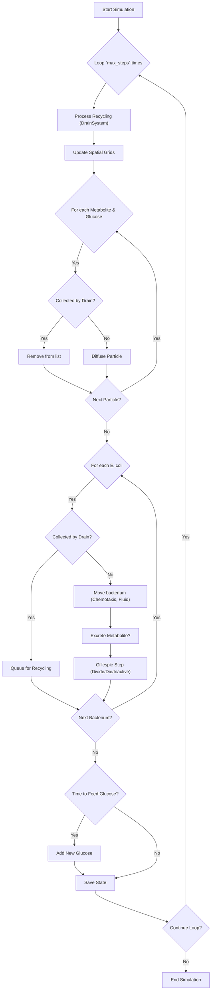

# Bacterial Growth Simulation Diagram in a Bioreactor

## Main Entities and Classes

*   **E. coli (bacterium)**
    *   *Attributes:* position (x, y), ATP level (energy), size (width, height), etc.
    *   *Behaviors:* moves via chemotaxis towards glucose, consumes glucose to gain ATP, excretes acetate (metabolite), divides if its ATP exceeds a threshold, or dies if ATP is too low or acetate toxicity is too high. Movement is also influenced by a simulated fluid field.

*   **Glucose**
    *   *Attributes:* position (x, y), diameter, specific gravity, momentum (horizontal, vertical).
    *   *Behaviors:* diffuses in the medium (Brownian motion) with a gravitational bias, bounces off the domain edges, and is influenced by the fluid field.

*   **Metabolite (Acetate)**
    *   *Attributes:* position, type, diffusion rate, local concentration, toxicity threshold and potential, gravity.
    *   *Behaviors:* diffuses randomly with a gravity effect and the influence of the fluid flow. The concentration decreases over time. The *toxicity* of acetate depends on the local concentration around the bacterium and can reduce the bacteria's ATP or cause their death.

*   **StreamField (fluid field)**
    *   A structure defining a velocity field (vx, vy) over the entire domain. It combines a basic downward flow, an upward flow, and circulation effects around the drains. This field is applied to all particles to simulate a bioreactor environment.

*   **DrainSystem (drain system)**
    *   A device located at the bottom of the reactor that collects particles.
    *   *Metabolites* captured: are removed from the simulation.
    *   *Bacteria/Glucose* captured: are queued for recycling and re-injected at the top of the domain after a certain delay.

*   **SpatialGrid (spatial grid)**
    *   Partitions the space into cells to speed up neighbor searches. Three grids are used (one for each particle type). They are updated at each step of the simulation to quickly find particles that are close to each other.

## Interactions between Entities

*   **E. coli → Glucose:** a bacterium consumes nearby glucose to increase its ATP. The consumption of two glucose molecules is necessary to produce one metabolite.

*   **E. coli → Metabolites:** a bacterium consumes glucose to excrete a metabolite (acetate), which costs energy (implicitly, through glucose consumption) and adds a Metabolite object to the medium.

*   **Metabolites → E. coli:** A high concentration of acetate is toxic to bacteria, draining their ATP and increasing the probability of death.

*   **Diffusion and gravity:** Glucose and metabolites diffuse in the fluid, undergoing Brownian motion with a gravitational bias.

*   **Fluid flow:** The *StreamField* affects the movement of all particles by applying a velocity vector to them at each point in the medium.

*   **Drains:** The drains at the bottom of the reactor collect particles. Metabolites are removed, while bacteria and glucose are recycled.

## Simulation Loop (`simulate` function)

The simulation advances in discrete time steps within a main loop. Here is a visual representation of the sequence of events at each step:

*   **Main loop** (iterated `max_steps` times): at each time step, the following cycle is executed:
    *   **Recycling (drain):** `process_recycling` from the `DrainSystem` reintroduces previously collected bacteria and glucose.
    *   **Updating spatial grids:** The `SpatialGrid`s are cleared and updated with the current positions of all particles to accelerate neighbor detection.
    *   **Diffusion & Collection:** For each `Metabolite` and `Glucose` particle, the system checks if it has been collected by a drain. If not, the particle diffuses based on Brownian motion, gravity, and fluid dynamics.
    *   **Bacteria Movement & Action:** For each `E. coli`, the system first checks for drain collection. If not collected, the bacterium moves (`move`) based on chemotaxis toward glucose, random noise, gravity, and the fluid field. It may then excrete a metabolite.
    *   **Stochastic Events (Gillespie Algorithm):** Each bacterium undergoes a Gillespie step (`gillespie_step`) which uses probabilities based on ATP levels and local glucose availability to determine if the bacterium will divide, die, or remain inactive.
    *   **Glucose Re-injection:** At regular intervals (`glucose_feed_interval`), new glucose is added at the top of the reactor to simulate a continuous nutrient supply.
    *   **State Recording:** The complete state of the simulation (all particle positions and attributes) is saved for later visualization and analysis.

## Key Configuration Parameters

The simulation's behavior can be significantly altered by adjusting parameters in the `SimulationConfig` class within the `Bioreactor_Simulation.py` file. Here are some of the most impactful ones:

*   **`ECOLI_DIVISION_THRESHOLD_ATP`**: The amount of ATP a bacterium must accumulate before it can divide.
*   **`ECOLI_SURVIVAL_THRESHOLD_ATP`**: The minimum ATP required for a bacterium to survive. If ATP drops below this, the bacterium is likely to die.
*   **`ACETATE_TOXICITY_THRESHOLD`**: The metabolite concentration at which toxic effects begin to appear, draining bacterial ATP.
*   **`ACETATE_LETHAL_CONCENTRATION`**: The metabolite concentration at which the toxic effect is maximized.
*   **`FLUID_BASE_DOWNWARD_FLOW`**: Controls the general downward velocity of the fluid in the bioreactor.
*   **`DRAIN_RECYCLING_DELAY_STEPS`**: The number of simulation steps a bacterium or glucose particle must wait in the drain system before being recycled back into the environment.
*   **`glucose_feed_interval` / `glucose_feed_amount`**: These parameters, set when calling the `simulate` function, control how often and how much glucose is added to the system.

## Export and Visualization

*   **Detailed CSV export:** The `export_detailed_data` function generates a CSV file with detailed statistics for each step of the simulation (number of particles, average ATP, etc.).
*   **Summary image (PNG):** `export_summary_image` creates a graph with 4 subplots summarizing the evolution of the simulation (population, ATP, etc.).
*   **Interactive interface (Dash):** The `SimulationDashboard` class launches a web application to visualize the simulation. It displays a scatter plot of the particles, time-series graphs, and provides controls to play, pause, and reset the simulation.
